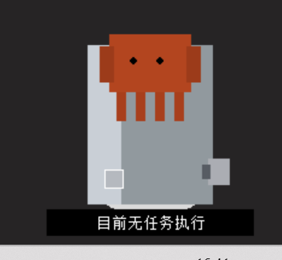

# Claw-jump-for-windows

该项目是[https://github.com/arczhi/claw-jump.git](https://github.com/arczhi/claw-jump.git "https://github.com/arczhi/claw-jump.git")的windows实现。

clawbot的图片素材均来自于`claw-jump`项目。

整个项目由claude code+deepseekv4 pro完成。
<div align="center">
  
  
</div>

## 主要功能及改进

Claude Code 完成一轮响应后，桌面右下角的clawbot会弹跳一下，并发出光芒，提醒你回来继续对话。

当claude code无任务时，显示“目前无任务执行”；

当claude code执行任务时，随机显示spinner verbs；

当claude code等待用户操作确认时，显示“等待用户操作”。

**新特性**

✅进行了windows系统的适配

✅新增了hooks类型，现在clawbot可以识别用户操作阶段

✅将spinner verbs词表加入执行任务时的显示，clawbot和claude code一样，可以随机显示词汇。（但是和终端中的词不一致）

✅解决了在终端中已经显示等待用户确认操作，但是clawbot依旧要等到1到2秒才会显示“等待用户操作”的延迟问题



## 安装及配置

#### 构建GO Hook（可选）

```bash 
cd claw-jump-go-v2
make build

```


编译完成后在`claw-jump-go-v2\bin`下生成claw-jump-hook的二进制文件，重命名为`claw-jump-hook.exe`。可以直接在release中下载编译好的exe文件 **。**

#### 启动Agent

可以直接通过release中的exe可执行文件直接双击执行。

（可选）可以通过python命令行进行clawbot的主程序启动，一般为调试用。

```bash 
cd portable/agent
python claw_jump_agent.py
```


看到以下输入即为python启动成功。

```markdown 
Starting Claw Jump agent on port 47653
HTTP server listening on 127.0.0.1:47653
Claw Jump agent running. Press Ctrl+C or use tray menu → Quit to stop.
```


#### claude的settings.json配置（重要）

找到claude的全局配置文件夹，一般为`C:\Users\yourusername\.claude`。

在`settings.json`文件中新增hooks项，`yourpath`填写你存放`claw-jump-hook.exe`的路径。

```bash 
{
  "hooks": {
    "Stop": [
      {
        "hooks": [
          {
            "type": "command",
            "command": "\"yourpath\\claw-jump-hook.exe\" stop",
            "timeout": 3
          }
        ]
      }
    ],
    "UserPromptSubmit": [
      {
        "hooks": [
          {
            "type": "command",
            "command": "\"yourpath\\claw-jump-hook.exe\" reset",
            "timeout": 3
          }
        ]
      }
    ],
    "Notification": [
      {
        "hooks": [
          {
            "type": "command",
            "command": "\"yourpath\\claw-jump-hook.exe\" notification",
            "timeout": 3
          }
        ]
      }
    ],
    "PermissionRequest": [
      {
        "hooks": [
          {
            "type": "command",
            "command": "\"yourpath\\claw-jump-hook.exe\" permission_request",
            "timeout": 3
          }
        ]
      }
    ],
    "PreToolUse": [
      {
        "hooks": [
          {
            "type": "command",
            "command": "\"yourpath\\claw-jump-hook.exe\" working",
            "timeout": 3
          }
        ]
      }
    ],
    "PostToolUse": [
      {
        "hooks": [
          {
            "type": "command",
            "command": "\"yourpath\\claw-jump-hook.exe\" working",
            "timeout": 3
          }
        ]
      }
    ]
  }
}

```
